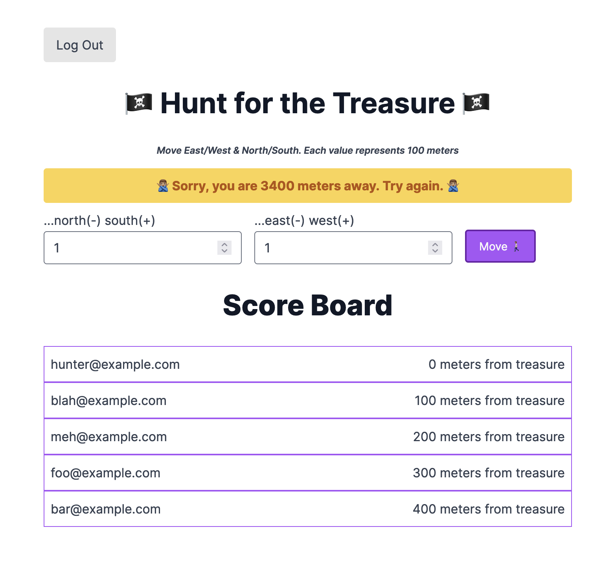

# Treasure Hunt




## Security
1. Active Record Encryption
> Implemented [Active Record `encrypts`](https://guides.rubyonrails.org/active_record_encryption.html)
>> Encrypted values everywhere show up on server logs as `[FILTERED]`. If this was not the case, an attacker could parse an append-only log and cheat. 
>>
>> Also, the use of `Dotenv` allows for a `.env` file to provide `ENV` variables in the `TreasureHunt::Application` file. This initialized the encrypted keys that provide the machinery for ActiveRecord to safely persist encrypted values in a data store/database.

2. Class Encapsulation
> In addition to the tools that ActiveRecord provides with model encapsulation, the `Game` class sets a distinction between `public` api methods and those that are only accessible to the class. This ensures that the state of the `Game` class is tightly controlled by the objects that are instantiated.
>

3. Devise for Authentication
> [Devise](https://github.com/heartcombo/devise) is a Ruby gem that provides reasonable and safe authentication machinery.

## Game Logic


## Todo
- [ ] refactor using Turbo
  - [ ] reference the [thoughtbot hotwire example repo](https://github.com/thoughtbot/hotwire-example-template?tab=readme-ov-file)
  - [ ] reference [GoRails Twitter inline editing clone](https://www.youtube.com/watch?v=1WeKlk7GG80&t=941s)
  - [ ] or, [digging into Turbo with Rails 7 video](https://www.youtube.com/watch?v=0CSGsHnci2I)
- [ ] Email on on game win 
  - [ ] reference [DHH Rails 7 Demo](https://www.youtube.com/watch?v=mpWFrUwAN88)
- [ ] build out end game
- [ ] only allow one email per win
- [ ] improve winnings list
  - [ ] add pagination to winnings list
    - [ ] [hotwire-example-template - pagination](https://github.com/thoughtbot/hotwire-example-template/tree/hotwire-example-pagination?tab=readme-ov-file)
  - [ ] reference the [thoughtbot hotwire example repo](https://github.com/thoughtbot/hotwire-example-template?tab=readme-ov-file)
- [ ] Make a zight showing the game being played
- [ ] fix broken tests from adding encryption. [see this gb issue](https://github.com/rails/rails/issues/48601)


### Links

#### Flash Messages
- [custom flashes](https://github.com/rails/rails/blob/main/actionpack/lib/action_controller/metal/flash.rb)
- [nice post on flashes](https://spaquet.medium.com/rails-flash-what-you-need-to-know-41efb61659f2)


## Steps
### Install Tailwind
[gorails - install tailwind css](https://gorails.com/episodes/adding-tailwindcss-to-rails)
> [tailwindcss-rails gem](https://github.com/rails/tailwindcss-rails)

> $ `rails new treasure_hunt --database=postgresql --css tailwind`
> 
> $ `cd treasure_hunt`
> 
> then, as per tailwind-rails docs
> 
> 
> 1. Run `./bin/bundle add tailwindcss-rails`
> 2. Run `./bin/rails tailwindcss:install`
> 
> 
> now, to run the rails server, we will no longer use `rails server`
> 
> instead, we start thru foreman with:
> 
> `bin/dev`
> 
> ...foreman not found, need to 
> 
> [`gem install foreman`](https://stackoverflow.com/questions/75405582/bin-dev-8-exec-foreman-not-found)
> 
> **NOTE:** Ruby users should take care not to install foreman in their project's Gemfile. See this [foreman wiki article](https://github.com/ddollar/foreman/wiki/Don%27t-Bundle-Foreman) for more details.


### Build the GameController
>`bin/rails generate controller Games start move`
>
>```
>   create  app/controllers/games_controller.rb
>    route  get 'games/start'
>           get 'games/move'
>   invoke  tailwindcss
>   create    app/views/games
>   create    app/views/games/start.html.erb
>   create    app/views/games/move.html.erb
>   invoke  test_unit
>   create    test/controllers/games_controller_test.rb
>   invoke  helper
>   create    app/helpers/games_helper.rb
>   invoke    test_unit
>```